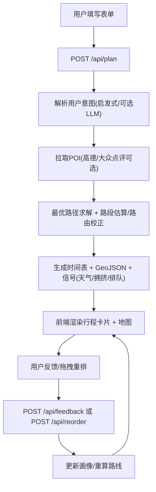

## 1. 产品概述
GeoRouter 是一个开源的「偏好识别 + 路线最优化 + 地图可视化」旅游/城市漫游路线规划网站。
面向想要快速生成可执行行程、并能通过反馈让系统逐步理解个人偏好的用户与开发者。

## 2. 核心功能

### 2.1 用户角色
本产品不做账号体系，仅使用「用户ID」作为本地画像记忆的标识。
| 角色 | 使用方式 | 核心权限 |
|------|----------|----------|
| 访客用户 | 默认 userId=guest | 使用全部规划能力，但画像保存在本地 data 目录 |
| 自定义用户 | 手动输入 userId | 保存/读取该 userId 的偏好画像，影响后续规划 |

### 2.2 功能模块
1. **路线生成**：输入城市、时间窗、起点、出行方式与自然语言诉求，生成单日最优路线与时间表。
2. **多日/多城行程**：通过天数与城市列表生成多日规划，并提供分日切换。
3. **地图可视化**：以地图展示路线折线与点位，鼠标悬停查看顺序与到离时间。
4. **拖拽重排**：在行程卡片中拖拽调整顺序，服务端重算路段与时间表。
5. **反馈学习**：对单个点位做「喜欢/不喜欢/跳过」反馈，更新画像关键词权重与偏好。
6. **画像查看与更新**：查看服务端返回的画像摘要（偏好/必选/避雷/学习到的关键词）。
7. **无密钥可运行模式（Demo）**：在未配置外部 API Key 时提供内置示例数据与直线估算，保证页面可运行与可演示。
8. **文档与部署**：提供本地运行、环境变量、部署与贡献指南，满足开源发布与复现。

### 2.3 页面详情
| 页面名称 | 路由 | 模块名称 | 功能描述 |
|----------|------|----------|----------|
| 规划器 | / | 输入表单 | userId、日期、自然语言诉求、城市、出行方式、起点、开始/结束时间、多日与城市列表 |
| 规划器 | / | 结果面板 | 规划元信息、分日 Tabs（多日）、行程卡片列表（含反馈按钮） |
| 规划器 | / | 地图区域 | 点位与路径绘制、Tooltip 展示顺序与到离时间、自动 fitBounds |
| 文档页 | /docs | 快速开始 | 安装、启动、Demo 模式说明 |
| 文档页 | /docs | 配置说明 | 环境变量、外部数据源、隐私与本地存储说明 |
| 文档页 | /docs | 部署指南 | 常见平台部署建议（Node/容器）、健康检查与端口说明 |

## 3. 核心流程
主要用户流程：
1. 用户在首页填写参数并点击「生成最优路线」。
2. 前端请求 /api/plan，服务端解析意图、拉取 POI、计算最优顺序、生成时间表与 GeoJSON。
3. 前端渲染行程与地图；用户可切换天数或拖拽卡片重排。
4. 用户对点位反馈（喜欢/不喜欢/跳过），服务端写入反馈并更新画像，后续规划会受到画像影响。

## 4. 用户界面设计
### 4.1 设计风格
- 视觉基调：GIS 产品感 + 信息密度可控，强调「可读性」与「可操作性」
- 色彩：深色中性背景 + 1 个主强调色（路线/按钮）+ 2 个语义色（起点/餐饮/景点）
- 字体：以系统字体为基础，保证跨平台稳定；标题与数字信息强化层级
- 布局：桌面端双栏（表单/结果 + 地图），结果列表可滚动；移动端上下布局
- 动效：按钮与拖拽状态的轻量反馈，避免干扰阅读

### 4.2 页面设计概览
| 页面名称 | 模块名称 | UI 元素 |
|----------|----------|---------|
| 规划器 | 输入表单 | 分组表单、提示文案、下拉选择、主按钮、状态栏 |
| 规划器 | 行程卡片 | 卡片序号、标签（起点/吃饭/景点）、到离时间、路段信息、信号（拥挤/排队/天气风险）、反馈按钮 |
| 规划器 | 地图 | 路线折线、点位圆点、Tooltip、自动缩放、图例（可选） |
| 文档页 | 文档内容 | 章节导航、代码块、环境变量说明、部署步骤 |

### 4.3 响应式
- 桌面优先：≥1024px 为双栏布局
- 移动端：表单折叠/可滚动，地图与列表分区，触控拖拽体验可用
