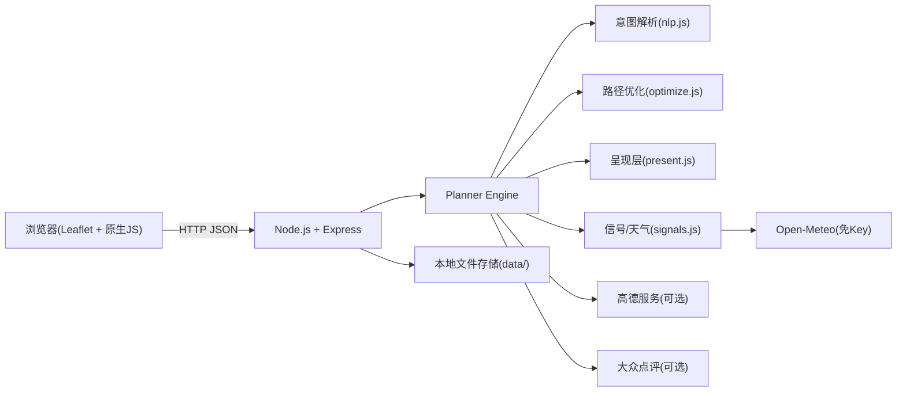
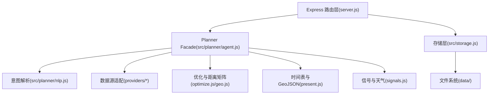
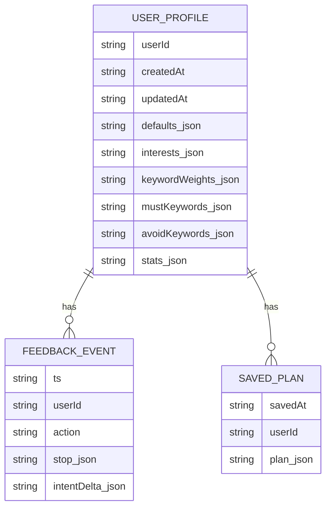

## 1. 架构设计



## 2. 技术说明
- 运行时：Node.js（CommonJS）
- Web Server：express@4（静态资源 + JSON API）
- 前端：public/ 下的原生 HTML/CSS/ESM JS；地图使用 Leaflet（CDN）
- 外部数据源（可选）：
  - 高德：地理编码、周边 POI、分段路由（需要 AMAP_KEY）
  - 大众点评：餐厅搜索（需要 DIANPING_BASE_URL/DIANPING_API_KEY）
  - LLM：意图解析增强（需要 LLM_BASE_URL/LLM_API_KEY/LLM_MODEL）
  - Open-Meteo：天气（免 Key）
- 数据存储：本地文件（profiles/、plans/、feedback/），用于用户画像与最近一次规划缓存

## 3. 路由定义
| Route | Purpose |
|-------|---------|
| GET /api/health | 健康检查 |
| POST /api/plan | 生成单日/多日路线（trip 可选） |
| GET /api/profile | 获取用户画像摘要 |
| POST /api/profile/update | 更新用户画像配置（默认偏好、关键词等） |
| POST /api/feedback | 写入点位反馈并学习到画像 |
| POST /api/reorder | 依据前端拖拽顺序重算路线与时间表 |
| GET / | 静态站点入口（public/index.html） |
| GET /docs | 文档页（计划新增的静态页面） |

## 4. API 定义

### 4.1 POST /api/plan
请求体（简化）：
```ts
type TransportMode = "transit" | "walking" | "driving" | "bicycling"

type TripDay = {
  dayIndex?: number
  label?: string
  city: string
  startLocation: string | { name?: string; lng: number; lat: number }
  startTime: string
  endTime: string
  transport: TransportMode
  date?: string | null
  query: string
}

type PlanRequest = {
  userId: string
  date?: string | null
  city: string
  query: string
  transport: TransportMode
  startLocation: string | { name?: string; lng: number; lat: number }
  startTime: string
  endTime: string
  trip?: { days: TripDay[] }
}
```

响应体（核心字段）：
```ts
type PlanStop = {
  id: string
  name: string
  kind: "start" | "food" | "attraction"
  type?: string
  location: { lng: number; lat: number }
  rating?: number
  cost?: number
}

type PlanLeg = {
  fromId: string
  toId: string
  mode: TransportMode
  distanceM: number
  durationSec: number
  polyline: Array<{ lng: number; lat: number }>
}

type ScheduleItem = {
  stopId: string
  arrive: string
  depart: string
  dwellMin: number
  crowdIndex?: number
  queueMin?: number
  weatherRisk?: number
  weatherNote?: string | null
}

type PlanResponse = {
  ok: boolean
  meta: {
    city: string
    date?: string | null
    providersUsed: { amap: boolean; dianping: boolean }
    warnings: string[]
    weather?: {
      provider: "open-meteo"
      date: string
      rainProb: number | null
      rainSum: number | null
      tmax: number | null
      tmin: number | null
      code: number | null
    } | null
  }
  preferences: unknown
  stops: PlanStop[]
  legs: PlanLeg[]
  schedule: ScheduleItem[]
  geojson: unknown
  profile?: unknown
  plans?: Array<{ dayIndex: number; label: string } & PlanResponse>
}
```

## 5. 服务端架构图


## 6. 数据模型

### 6.1 数据模型定义


### 6.2 数据定义语言
当前使用文件系统持久化（JSON/JSONL），不引入数据库；若未来需要多用户在线化可扩展到 SQLite/PostgreSQL。
